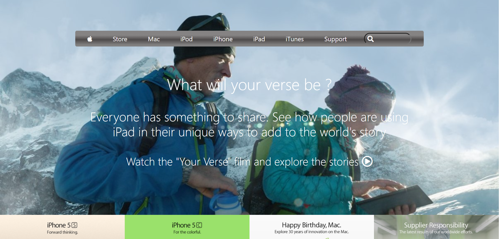

# Old Apple page 

> This project is a clone of the Apple old home page

<h4>Screeshots</h4>

## Built With

- HTML
- CSS (Used grid , flex and float)

## Live Demo

[Live Demo Link](https://pacyl2k19.github.io/old-apple-page/)

## Getting Started

1. First clone the project 
  `$ git clone https://pacyl2k19.github.io/old-apple-page/`
2. Then open index.html in your browser
3. [optional] You can even fork the project 

To get a local copy up and running follow these simple example steps.

### Prerequisites

Just ensure you have one or more web browsers

## 👤 Author

- GitHub: [@pacyL2K19](https://github.com/pacyL2K19)
- Twitter: [@PacifiqueLinja1](https://twitter.com/PacifiqueLinja1)
- LinkedIn: [LinkedIn](https://www.linkedin.com/in/pacifique-linjanja-2a565517b/)

## 🤝 Contributing

Contributions, issues, and feature requests are welcome!
Feel free to contribute 
Feel free to check the [issues page](https://github.com/pacyL2K19/old-apple-page/issues/1).

## Show your support

Give a ⭐️ if you like this project!

